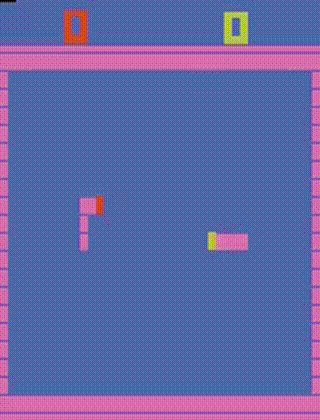

# Atari Surround RL

This repository implements reinforcement learning (RL) approaches to play the Atari game Surround. The goal is to train agents that can effectively learn and play the game using various RL algorithms.

### Example (Agent is on the Right)

[](https://youtube.com/v/pOTpUfn1w1o)

<em>Rainbow DQN Agent on Right (27.5K games) vs Gymnasium ALE built-in highest difficulty Surround opponent on Left</em> 

## Repository Structure
```
📦 
├─ Atari.ipynb                # Main notebook for Atari Surround training and evaluation
├─ LunarLander.ipynb          # Notebook for training and evaluating agents on Lunar Lander
├─ cartpole.ipynb             # Notebook for training and evaluating agents on CartPole
├─ agents/                    # RL algorithm implementations
│  ├─ __init__.py             # Module exports
│  ├─ agent.py                # Base agent class with abstract methods
│  ├─ dqn.py                  # Deep Q-Network implementation
│  ├─ dueling_dqn.py          # Dueling DQN architecture implementation
│  ├─ rainbow_dqn.py          # Rainbow DQN implementation with advanced features
│  └─ reinforce.py            # REINFORCE policy gradient implementation
├─ models/                    # Neural network architectures
│  ├─ __init__.py             
│  ├─ cnns.py                 # CNN architectures for image-based observations
│  ├─ mlps.py                 # MLP architectures for vector-based observations
│  └─ noisy_layers.py         # Noisy network layers for exploration
├─ wrappers/                  # Custom Gym environment wrappers
│  ├─ __init__.py
│  └─ gym_wrappers.py         # Wrappers for preprocessing and reward shaping
└─ setup.sh                   # Script to set up dependencies and environment
```

- **agents/**: Contains the implementation of RL algs, including REINFORCE.
- **models/**: Defines neural network architectures used by the agents.
- **wrappers/**: Custom Gym wrappers for preprocessing and reward shaping.
- **Atari.ipynb**: Jupyter Notebook for training and evaluating agents on Atari Surround.
- **LunarLander.ipynb**: Jupyter Notebook for training and evaluating agents on Lunar Lander.
- **setup.sh**: Script to set up the required environment and dependencies.

video and checkpoint directory will also be created automatically to record episodes and model weights.

# Key Components
## Agents

BaseAgent: Abstract base class defining the agent interface
ReinforcePolicyGradientsAgent: REINFORCE policy gradient implementation
DQNAgent: Deep Q-Network with prioritized experience replay
DuelingDQNAgent: Dueling DQN architecture with advantage/value streams
RainbowDQNAgent: Advanced DQN with Rainbow enhancements

## Models

MLPBackbone: Multi-layer perceptrons for vector-based observations
CNNBackbone: Convolutional networks for image-based observations
NoisyLinear: Noisy network layers for exploration in Rainbow DQN

## Environment Wrappers

Wrappers for reshaping observations, no-op removal, removing redudant transitions (especially for DQN) in Surround's turn-based system, reward shaping, etc.

## Quick Start 

**Set up the environment:**
```sh
./setup.sh
```

If setup doesn't work due to not automatically activating the conda env, activate it with `conda activate atari` or whatever your env is called and then copy the remaining install commands.

